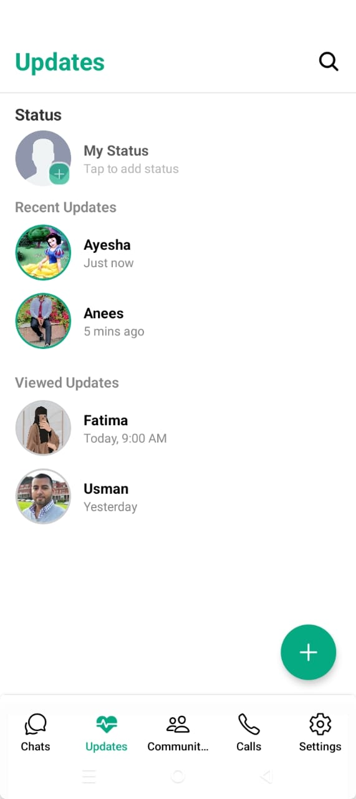

# 💬 ChatSphere


**ChatSphere** is a full-featured, modern messaging app inspired by WhatsApp. Built with **React Native**, **Expo**, and **Firebase**, it enables secure, real-time communication with an intuitive UI and powerful features.

---

## 🎥 Live Demo

> Place your GIF in: `assets/images/demo.gif`


---

## 🧩 App Features

### 🔐 Authentication

- `LoginPage` – User login using email or phone
- `Signup` – User registration
- `PhoneNumberScreen` – Phone-based login & verification
- Firebase Authentication integration

---

### 💬 Messaging

- `ChatScreen` – One-on-one and group messaging
- Real-time message delivery using Firebase Firestore
- Message reactions, translation, and attachments

---

### 📞 Calling

- `CallScreen` – Voice and video calls
- Uses Expo Media APIs and Firebase signaling

---

### 👥 Communities

- `Communities` – Create & manage interest-based groups
- Post announcements, share media
- Community chat similar to WhatsApp

---

### 👤 User Management

- `Profile` – View and update user profile
- Username + phone-based messaging support
- Profile image using Expo ImagePicker

---

### 🔔 Updates & Notifications

- `Updates` – See system messages or app-wide updates
- Push notifications using Firebase Cloud Messaging

---

## 📸 Screenshots

> Make sure you put screenshots here: `assets/images/`

### 🟢 Login Page  


### 🟣 Signup  


### 💬 Chat Screen  


### 📞 Call Screen  


### 🌐 Communities  


### 👤 Profile  


### 🔔 Updates  


---

## 🛠️ Built With

- [React Native](https://reactnative.dev/)
- [Expo](https://expo.dev/)
- [Firebase (Auth, Firestore, Storage)](https://firebase.google.com/)
- [Tailwind CSS via NativeWind](https://www.nativewind.dev/)
- [React Navigation](https://reactnavigation.org/)
- [Expo Media & ImagePicker APIs](https://docs.expo.dev/)

---

## 📦 Installation

```bash
git clone https://github.com/221400100/Whatsapp_Clone_Chatsphere.git
cd Whatsapp_Clone_Chatsphere
npm install
npx expo start
